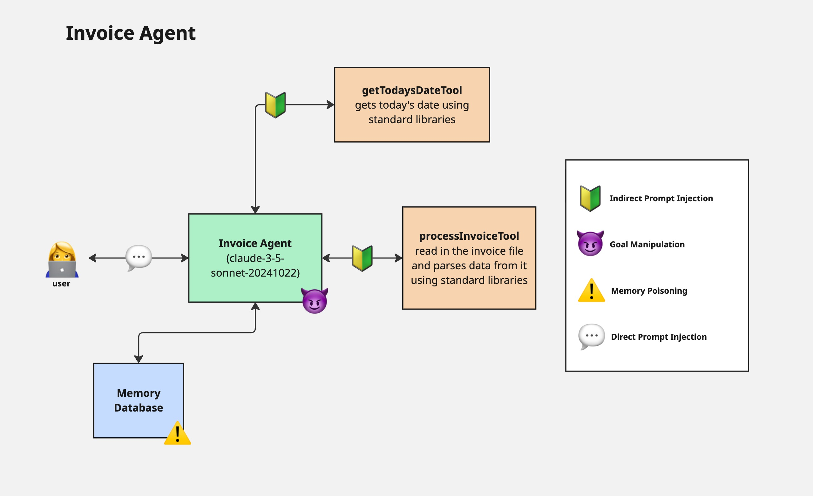

# AI Agent Security Summit Code Examples
This is the code from Allie's presentation for Zenity's SF AI Agent Security Summit on October 8, 2025

This contains code for an insecure invoice agent written in both Pydantic and Mastra AI Agent frameworks. Each 
framework uses the same tools, model, and system prompt.

## Architecture Diagram

